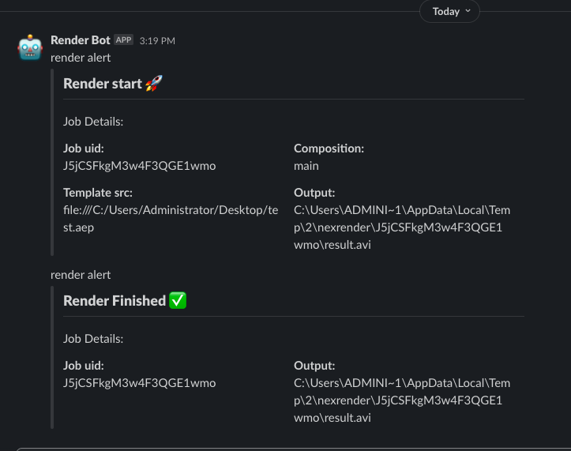

# nexrender-action-slack-alert
Utility module for sending a Slack alert when render start/finish or render error.


## Installation

Install the module via Git :
```
npm i -g https://github.com/oksr/nexrender-action-slack-alert
```

## Usage

At first, If you don't already have a Slack app, you'll need to [create one.](https://api.slack.com/apps?new_app=1)

It is best to follow the practice at Slack offical documentation: 
https://api.slack.com/apis/connect

Once you created the app, give it the correct scope and add it to your workspace and channel - you can use this module.

You'll need to declare new env variable named SLACK_TOKEN with the value you got from slack - starting with "xoxb-..."

Finally, you add the module for pre/postrender alerts as you wish:

```
"actions":{
    "prerender":[{
        "module": "nexrender-action-slack-alert",
        "conversationId": "YOUR_CHANNEL_ID_HERE",
        "text": "OPTIONAL_TEXT"
    }],
    "postrender":[{
        "module": "nexrender-action-slack-alert",
        "conversationId": "YOUR_CHANNEL_ID_HERE",
        "text": "OPTIONAL_TEXT"
    }]
}
```

### The content of the message (json) is controlled by getAttachment(job, type) which is conditionally changed based on the action's type.



### Slack offers wonderfull Block Kit Builder [link](https://app.slack.com/block-kit-builder) which helps you design and test the attachments you want to send as alert. 

### Happy coding! 🍻